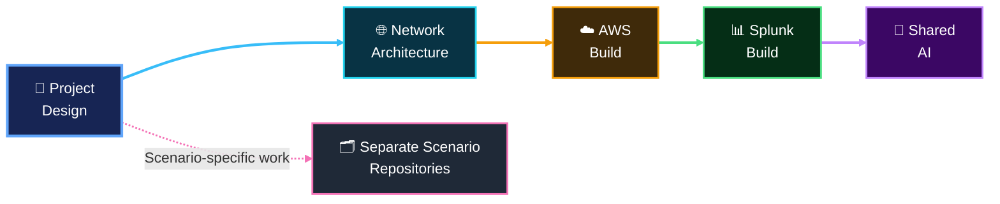

[🏠 Repository Home](../README.md) · **🧭 Project Design** · [🌐 Network Architecture](../01-network-architecture/README.md)

This folder is the **source of truth for what the lab is building and why**. It keeps scope, team model, scenario boundaries and implementation sequencing separate from low-level AWS/Splunk configuration.

## 📚 Design Documents

| Document | Purpose |
|---|---|
| 🎯 [`project-scope.md`](project-scope.md) | Objective, boundaries, technology choices and success criteria |
| 👥 [`team-roles.md`](team-roles.md) | Four rotating roles and shared responsibilities |
| 🧪 [`scenario-matrix.md`](scenario-matrix.md) | Side-by-side view of all four DNS scenarios |
| 🚦 [`project-roadmap.md`](project-roadmap.md) | Build sequence and current progress |
| 📡 [`scenario-dns-plan.md`](scenario-dns-plan.md) | Permanent child-zone baseline and later scenario-specific DNS changes |
| 🏗️ [`scenario-infrastructure-roadmap.md`](scenario-infrastructure-roadmap.md) | Implemented Scenario 02 defender-DNS resources, completed Scenario 03 Fast Flux extension, and completed Scenario 04 authoritative-DNS preparation |
| 📋 [`scenario-documentation-standard.md`](scenario-documentation-standard.md) | Required 20-part scenario workflow, network/MITRE discipline and dashboard standard |

## 🧭 How This Section Fits

Detailed VPC, subnet, routing, DNS authority and traffic decisions belong in [`../01-network-architecture/`](../01-network-architecture/) so project scope does not become a duplicate architecture manual.

## 🚦 Current Design State

- The **four-scenario model** remains the shared baseline.
- The **shared AI foundation** is complete.
- The **official Scenario 01 adversary boundary** is a separate AWS account, the original in-account attack VPC remains historical engineering evidence.
- The **Scenario 02 defender-DNS infrastructure** is complete.
- The **Scenario 03 Fast Flux extension** is complete.
- **Scenario 04 is now complete end to end:** authoritative-DNS preparation, Detection Engineering, the information-separated operator/SOC/IR exercise, human-approved RPZ containment verification, safe reset and final closeout are maintained in the dedicated Scenario 04 repository.
- Scenario implementation/evidence is maintained in separate scenario repositories.

[`scenario-infrastructure-roadmap.md`](scenario-infrastructure-roadmap.md) records what is already implemented across the scenario-specific infrastructure extensions and what remains operationally conditional. [`scenario-documentation-standard.md`](scenario-documentation-standard.md) keeps all four scenario repositories reproducible and consistent.

[🏠 Repository Home](../README.md) · [🌐 Next: Network Architecture](../01-network-architecture/README.md)
