<!-- dns-soc-nav:start -->
[🏠 Repository Home](../README.md) · [📁 00 Project Design](README.md)
<!-- dns-soc-nav:end -->

# Team Roles

**Role assignment model — designed and proposed by [Lubaba](https://github.com/lubaba1513-pixel).** The project rotates responsibilities across scenarios so team members practise simulation, SOC investigation, Detection Engineering and Incident Response from different viewpoints. The matrix below is the current canonical assignment for each scenario.

The project uses these four rotating roles. Nobody waits for another person to finish an entire phase; each role has preparation, live-session and documentation work that can run in parallel.

## Role responsibilities

### Project Lead / Attack Simulation Operator

Coordinates the scenario and makes sure the environment, network path and dependencies work together. The Project Lead operates the authorized simulation for that scenario and records exact timing/actions as ground truth.

Typical work:
- coordinate AWS and scenario readiness;
- verify required connectivity without opening unnecessary access;
- maintain the execution timeline;
- run the approved simulation;
- preserve ground-truth commands and timestamps;
- coordinate final verification and repository evidence.

### SOC Analyst / Threat Hunter

Owns the human investigation. The analyst reviews the alert, raw DNS/network evidence and surrounding context before deciding whether activity is expected, suspicious or confirmed malicious.

Typical work:
- prepare investigation searches and questions;
- review source, query, record type, time, frequency and response behavior;
- correlate DNS activity with web/network/system evidence when available;
- compare AI output with raw Splunk events;
- determine scope and document the evidence-backed conclusion.

### Detection Engineer / AI Integrator

Turns the scenario's threat behavior into measurable, testable detection logic.

Typical work:
- verify the required data and fields are available;
- define a detection hypothesis;
- build and tune SPL searches and alerts;
- test normal traffic against simulated attack traffic;
- document false positives, thresholds and MITRE mapping;
- define which alert fields are useful for AI-assisted summarization.

### Incident Responder / Defender

Takes over when the SOC confirms an incident or when the exercise reaches the response checkpoint.

Typical work:
- prepare the response playbook before execution;
- preserve relevant evidence and establish scope;
- select an authorized containment action;
- reduce unnecessary exposure where appropriate;
- verify the response changed the observed behavior;
- document containment, recovery and final status.

## Rotation matrix

| Scenario | Project Lead | SOC Analyst | Detection Engineer | IR / Defender |
|---|---|---|---|---|
| 01 — DNS Recon | Abdul-Rehman | Musfira | Sonia | Lubaba |
| 02 — DGA + NXDOMAIN | Musfira | Sonia | Lubaba | Abdul-Rehman |
| 03 — Fast Flux | Lubaba | Abdul-Rehman | Musfira | Sonia |
| 04 — DNS Tunneling | Sonia | Lubaba | Abdul-Rehman | Musfira |

The role table records the current scenario assignments. Individual scenario repositories provide the evidence for what each member actually implemented or executed.

## Shared AI foundation

AI is shared infrastructure, not a fifth role and not a replacement for SOC judgement. The common Flask/LLM bridge is built once after the Web/AWS data-quality gates and then reused by all scenario repositories.

For the initial shared AI foundation:

| Team member | Shared responsibility |
|---|---|
| [**Sonia**](https://github.com/sonia11mansha415) | Define the useful alert fields, AI payload requirements and detection-to-AI contract |
| [**Abdul-Rehman**](https://github.com/abdul4rehman215) | Coordinate Flask placement, Docker/network connectivity, API configuration and integration readiness |
| [**Musfira**](https://github.com/MUSFIRA-ZAFAR) | Test whether the AI summary is accurate, useful and consistent with raw Splunk evidence |
| [**Lubaba**](https://github.com/lubaba1513-pixel) | Review whether AI response suggestions are safe, relevant and still require human approval |

The bridge and output schema stay common. Scenario-specific context/prompt profiles are added only after each scenario's detection fields are stable.

## Shared working rule

All four members should understand the complete chain:

```mermaid
flowchart TB

    %% =====================================================
    %% ROW 1
    %% =====================================================
    subgraph PREP["⚙️ Prepare & Trigger"]
        direction LR

        A["🏗️ Environment<br/>Ready"]
        B["📡 Telemetry<br/>Visible"]
        C["🧪 Detection<br/>Tested"]
        D["🎯 Simulation"]
        E["🚨 Alert"]

        A --> B --> C --> D --> E
    end


    %% =====================================================
    %% ROW 2
    %% =====================================================
    subgraph RESP["🛡️ Analyze, Respond & Close"]
        direction LR

        F["🤖 AI<br/>Enrichment"]
        G["🔎 SOC<br/>Confirmation"]
        H["🛡️ IR<br/>Response"]
        I["✅ Verification"]
        J["📝 Documentation"]

        F --> G --> H --> I --> J
    end


    %% Connect GROUP to GROUP instead of E --> F
    PREP --> RESP


    %% =====================================================
    %% STYLING
    %% =====================================================
    classDef ready fill:#172554,stroke:#60a5fa,stroke-width:2px,color:#fff;
    classDef telemetry fill:#083344,stroke:#22d3ee,stroke-width:2px,color:#fff;
    classDef detection fill:#3b0764,stroke:#c084fc,stroke-width:2px,color:#fff;
    classDef simulation fill:#713f12,stroke:#f59e0b,stroke-width:2px,color:#fff;
    classDef alert fill:#450a0a,stroke:#f87171,stroke-width:2px,color:#fff;

    classDef ai fill:#581c87,stroke:#e879f9,stroke-width:2px,color:#fff;
    classDef soc fill:#164e63,stroke:#38bdf8,stroke-width:2px,color:#fff;
    classDef ir fill:#7f1d1d,stroke:#fb7185,stroke-width:2px,color:#fff;
    classDef verify fill:#052e16,stroke:#4ade80,stroke-width:2px,color:#fff;
    classDef docs fill:#1f2937,stroke:#94a3b8,stroke-width:2px,color:#fff;

    class A ready;
    class B telemetry;
    class C detection;
    class D simulation;
    class E alert;

    class F ai;
    class G soc;
    class H ir;
    class I verify;
    class J docs;

    style PREP fill:#0d1117,stroke:#58a6ff,stroke-width:1px
    style RESP fill:#0d1117,stroke:#3fb950,stroke-width:1px

    linkStyle default stroke:#8b949e,stroke-width:2px
```

<!-- dns-soc-footer:start -->

[🏠 Repository Home](../README.md) · [📁 00 Project Design](README.md)

DNSentinel Lab · Controlled DNS security training documentation

<!-- dns-soc-footer:end -->
