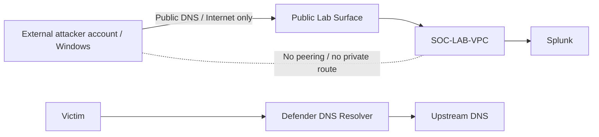

[🏠 Repository Home](../README.md) · [🧭 Project Design](../00-project-design/README.md) · **🌐 Network Architecture** · [☁️ AWS Build](../02-aws-build/README.md)

This folder is the **network and DNS blueprint** for the lab. It explains how traffic moves, how the public namespace is delegated, how the official external adversary is separated from the defender AWS account, and how the defender-controlled DNS path fits into the locked design.

## 🗺️ Architecture Documents

| Document | Purpose |
|---|---|
| 🏗️ [`base-network.md`](base-network.md) | Overall AWS network design and trust boundaries |
| 🧮 [`cidr-plan.md`](cidr-plan.md) | Defender CIDRs plus the historical in-account attack-VPC record |
| 🕶️ [`external-adversary-boundary.md`](external-adversary-boundary.md) | Official Scenario 01 separate-account attacker trust boundary |
| 🔐 [`security-groups.md`](security-groups.md) | Baseline and Scenario 02 service exposure / SG-to-SG access |
| 🌍 [`dns-authority-and-delegation.md`](dns-authority-and-delegation.md) | Registrar, parent zone, child zone and public DNS delegation |
| 🔀 [`traffic-flow.md`](traffic-flow.md) | Management, DNS, public target, logging, defender DNS and response paths |
| 🧩 [`diagrams/`](diagrams/) | Editable Mermaid source used by architecture documentation |

## 🔐 Trust Boundary at a Glance

Implementation evidence stays in [`../02-aws-build/`](../02-aws-build/); Splunk-side data onboarding stays in [`../03-splunk-build/`](../03-splunk-build/).

## 🛡️ Scenario Platform State

`SOC-MONITORING-SUBNET` is active and hosts the Scenario 02 defender DNS platform:

| Host | Address | Role |
|---|---:|---|
| `dns-soc-resolver01` | `10.50.30.10` | Unbound resolver / defender DNS |
| `dns-soc-victim01` | `10.50.30.20` | Controlled victim endpoint |
| `dns-soc-sinkhole01` | `10.50.30.30` | Private sinkhole target |

The subnet remains private and uses `SOC-MONITORING-NAT` for outbound package/management egress. No private attacker-to-SOC route exists. The official Scenario 01 adversary is outside the defender account and uses public Internet paths only.

[🧭 Previous: Project Design](../00-project-design/README.md) · [🏠 Repository Home](../README.md) · [☁️ Next: AWS Build](../02-aws-build/README.md)
