<!-- dns-soc-nav:start -->
[🏠 Repository Home](../README.md) · [📁 01 Network Architecture](README.md)
<!-- dns-soc-nav:end -->


# DNS Authority and Delegation

## Objective

Give the SOC lab a real delegated public namespace without replacing the existing website and mail services on `abdul4rehman215.tech`.

The final design separates registration, parent authority and child authority instead of treating Route 53 as one flat DNS service.

## Authority model

| Layer | Service | Responsibility |
|---|---|---|
| Registrar | Hostinger | Holds the domain registration and publishes the parent Route 53 nameservers at the registry |
| Parent authoritative DNS | Route 53 | Serves `abdul4rehman215.tech`, including existing website/mail records and the `soclab` delegation |
| Child authoritative DNS | Route 53 | Serves the permanent SOC lab DNS baseline, including the main web target, `www` alias and reconnaissance TXT fixture |
| Public web target | EC2 Elastic IP | `100.49.192.164` associated with `dns-soc-web01` |

## Delegation design

```mermaid
flowchart TB

    %% =====================================================
    %% REGISTRAR / DNS HIERARCHY
    %% =====================================================
    subgraph ROOT[" "]
        direction TB

        RH["🌍 Registrar & DNS Hierarchy"]

        Registrar["🏷️ Hostinger<br/>Registrar"]
        TLD["🌐 .tech Registry<br/>DNS Hierarchy"]

        RH --> Registrar
        Registrar -. "Registered Nameservers" .-> TLD
    end


    %% =====================================================
    %% PARENT DOMAIN
    %% =====================================================
    subgraph PARENT[" "]
        direction TB

        PH["🏠 Parent DNS Zone<br/>abdul4rehman215.tech"]

        Parent["☁️ Route 53<br/>Parent Hosted Zone"]

        subgraph PARENTREC[" "]
            direction LR

            ParentSite["🌐 A Record<br/>2.57.91.91"]

            ParentMail["📨 Mail / TXT / CNAME<br/>Records"]

            ChildNS["🔀 NS Delegation<br/>soclab.abdul4rehman215.tech"]
        end

        PH --> Parent

        Parent --> ParentSite
        Parent --> ParentMail
        Parent --> ChildNS
    end

    TLD --> PH


    %% =====================================================
    %% CHILD / LAB DNS
    %% =====================================================
    subgraph CHILD[" "]
        direction TB

        CH["🧪 Delegated Lab Zone<br/>soclab.abdul4rehman215.tech"]

        Child["☁️ Route 53<br/>Child Hosted Zone"]

        subgraph LABREC[" "]
            direction LR

            TXT["📝 TXT Record<br/>DNS SOC Training Lab"]

            Apex["🎯 A Record<br/>soclab → 100.49.192.164"]

            WWW["🔗 CNAME Record<br/>www → soclab"]
        end

        CH --> Child

        Child --> TXT
        Child --> Apex
        Child --> WWW

        WWW --> Apex
    end

    ChildNS -->|"Delegates Authority"| CH


    %% =====================================================
    %% WEB TARGET
    %% =====================================================
    Web["🖥️ dns-soc-web01<br/>Elastic IP<br/>100.49.192.164"]

    Apex -->|"Resolves To"| Web


    %% =====================================================
    %% HEADER STYLING
    %% =====================================================
    classDef rootheader fill:#422006,stroke:#fbbf24,stroke-width:2px,color:#ffffff,font-size:17px;
    classDef parentheader fill:#312e81,stroke:#818cf8,stroke-width:2px,color:#ffffff,font-size:17px;
    classDef childheader fill:#083344,stroke:#22d3ee,stroke-width:2px,color:#ffffff,font-size:17px;


    %% =====================================================
    %% NODE STYLING
    %% =====================================================
    classDef registrar fill:#422006,stroke:#fbbf24,stroke-width:2px,color:#ffffff;
    classDef registry fill:#172554,stroke:#60a5fa,stroke-width:2px,color:#ffffff;

    classDef parentzone fill:#312e81,stroke:#818cf8,stroke-width:3px,color:#ffffff;
    classDef parentrecord fill:#1f2937,stroke:#94a3b8,stroke-width:2px,color:#ffffff;
    classDef delegation fill:#581c87,stroke:#e879f9,stroke-width:3px,color:#ffffff;

    classDef childzone fill:#083344,stroke:#22d3ee,stroke-width:3px,color:#ffffff;
    classDef txtrecord fill:#164e63,stroke:#2dd4bf,stroke-width:2px,color:#ffffff;
    classDef arecord fill:#052e16,stroke:#4ade80,stroke-width:3px,color:#ffffff;
    classDef cname fill:#3b0764,stroke:#c084fc,stroke-width:2px,color:#ffffff;

    classDef server fill:#450a0a,stroke:#fb7185,stroke-width:3px,color:#ffffff;


    %% =====================================================
    %% APPLY CLASSES
    %% =====================================================
    class RH rootheader;
    class PH parentheader;
    class CH childheader;

    class Registrar registrar;
    class TLD registry;

    class Parent parentzone;
    class ParentSite,ParentMail parentrecord;
    class ChildNS delegation;

    class Child childzone;
    class TXT txtrecord;
    class Apex arecord;
    class WWW cname;

    class Web server;


    %% =====================================================
    %% CONTAINER STYLING
    %% =====================================================
    style ROOT fill:#0d1117,stroke:#fbbf24,stroke-width:1px
    style PARENT fill:#0d1117,stroke:#818cf8,stroke-width:1px
    style PARENTREC fill:#111827,stroke:#30363d,stroke-width:1px
    style CHILD fill:#0d1117,stroke:#22d3ee,stroke-width:1px
    style LABREC fill:#111827,stroke:#30363d,stroke-width:1px


    %% =====================================================
    %% EDGE STYLING
    %% =====================================================
    linkStyle default stroke:#94a3b8,stroke-width:2px
```



The registrar is part of domain administration, but normal DNS resolution follows the registry and authoritative nameserver chain.

## Parent zone

The parent Route 53 zone is authoritative for `abdul4rehman215.tech`.

Its authoritative nameservers are:

```text
ns-1398.awsdns-46.org.
ns-1752.awsdns-27.co.uk.
ns-455.awsdns-56.com.
ns-962.awsdns-56.net.
```

The existing parent website continues to resolve to:

```text
abdul4rehman215.tech -> 2.57.91.91
```

Mail-related records were also preserved in the parent zone so moving DNS authority did not intentionally move the website or email services themselves.

## Child zone

The delegated child hosted zone is:

```text
soclab.abdul4rehman215.tech
```

Its Route 53 nameservers are:

```text
ns-1750.awsdns-26.co.uk.
ns-1035.awsdns-01.org.
ns-645.awsdns-16.net.
ns-117.awsdns-14.com.
```

The child zone now keeps a five-record permanent baseline:

| Name | Type | Value | TTL |
|---|---|---|---:|
| `soclab.abdul4rehman215.tech` | A | `100.49.192.164` | 300 |
| `soclab.abdul4rehman215.tech` | NS | Four Route 53 child nameservers | 172800 |
| `soclab.abdul4rehman215.tech` | SOA | Route 53-managed SOA | 900 |
| `soclab.abdul4rehman215.tech` | TXT | `"DNS SOC Training Lab"` | 300 |
| `www.soclab.abdul4rehman215.tech` | CNAME | `soclab.abdul4rehman215.tech.` | 300 |

Both public web names ultimately reach the same Elastic IP:

```text
soclab.abdul4rehman215.tech     -> 100.49.192.164
www.soclab.abdul4rehman215.tech -> soclab.abdul4rehman215.tech -> 100.49.192.164
```

## Parent-to-child boundary

The parent zone contains an NS record for `soclab.abdul4rehman215.tech` pointing to the four child nameservers. The delegation record uses a 300-second TTL while the child zone's own Route 53 NS RRset remains at its standard longer TTL.

This distinction matters:

```text
Parent zone answers:
"Who is authoritative for soclab.abdul4rehman215.tech?"
        |
        v
Four child Route 53 nameservers
        |
        v
Child zone answers:
"What is the A record for soclab.abdul4rehman215.tech?"
        |
        v
100.49.192.164
```

The parent does not serve the child's A record directly. It refers resolvers to the child authority.

## Why the design changed

The initial plan was to keep the parent DNS outside Route 53 and delegate only the `soclab` namespace. During implementation, the available parent DNS editor did not expose the required NS-record workflow for the planned child delegation.

Instead of flattening the lab namespace into the parent zone, the parent authoritative DNS was migrated to Route 53. Existing parent records were preserved, and Route 53 then provided a clean parent-to-child delegation between two hosted zones.

The final design therefore keeps three responsibilities clear:

- Hostinger: registrar;
- Route 53 parent zone: existing parent services and child delegation;
- Route 53 child zone: SOC lab namespace.

## Validation model

The DNS design is considered valid only when all of these layers agree:

1. the registrar points the parent domain to the Route 53 parent nameservers;
2. the parent authoritative server returns the child NS referral;
3. a child authoritative server returns the child SOA, NS and A records;
4. public recursive resolvers return the same child nameservers, A record, `www` CNAME path and training TXT fixture;
5. `dig +trace` shows the parent-to-child handoff;
6. the existing parent website and mail-related DNS still resolve correctly.

The implementation evidence for these checks is recorded in [`../02-aws-build/05-route53-and-domain.md`](../02-aws-build/05-route53-and-domain.md).


## Scenario-specific DNS boundary

The five-record child baseline above is permanent infrastructure. Later scenarios do not require the team to redesign the parent/child delegation.

- Scenario 01 uses the existing records for reconnaissance and DNS-to-web follow-up.
- Scenario 02 intentionally generates nonexistent names to produce NXDOMAIN telemetry.
- Scenario 03 used a temporary controlled `flux.soclab...` A record with short TTL during the completed Fast Flux exercise; the temporary endpoint pool was retired after closeout.
- Scenario 04 uses the future controlled resolver/DNS path for tunneling telemetry rather than a fake permanent public record.
- Sinkhole behavior is implemented later inside the defender-controlled resolver path.

The detailed change-control plan is maintained in [`../00-project-design/scenario-dns-plan.md`](../00-project-design/scenario-dns-plan.md).


<!-- dns-soc-footer:start -->
<div align="center">

[🏠 Repository Home](../README.md) · [📁 01 Network Architecture](README.md)

<sub>DNSentinel Lab · Controlled DNS security training documentation</sub>

</div>
<!-- dns-soc-footer:end -->
