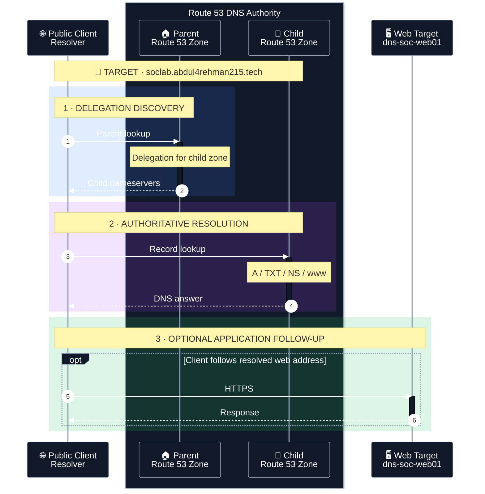
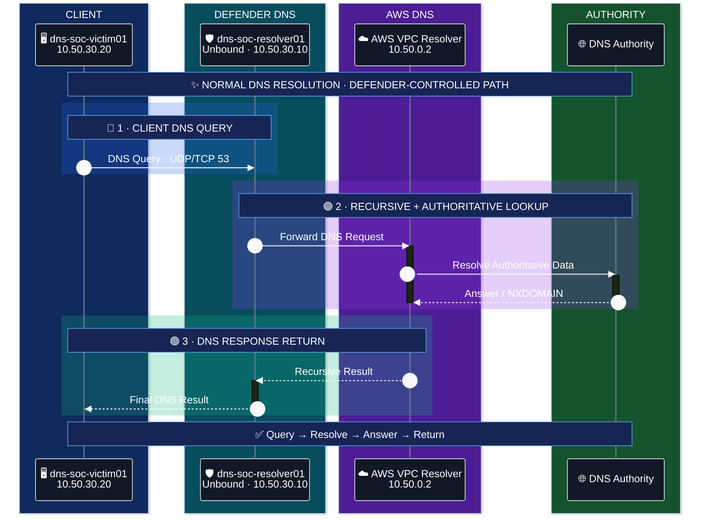

<!-- dns-soc-nav:start -->
[🏠 Repository Home](../README.md) · [📁 01 Network Architecture](README.md)
<!-- dns-soc-nav:end -->


# Traffic Flow

The lab has separate paths for public DNS, public scenario activity, SOC administration, Web telemetry, AWS telemetry, the completed defender-controlled DNS path and the shared AI bridge.

## Public DNS resolution path



## Scenario 01 public path

```text
Separate AWS account / Kali
        + optional external Windows
                 |
                 v
              Internet
                 |
                 +--> Route 53 child authority
                 |        +--> authoritative DNS response
                 |        +--> Route 53 query log -> Splunk
                 |
                 +--> optional public Web follow-up
                          +--> Nginx -> UF -> Splunk
                          +--> VPC Flow Logs -> Splunk
```

No attacker-to-SOC private route exists. The official attacker account does not forward its own CloudTrail, Flow Logs or Resolver logs into the defender SIEM. This preserves the information-separation boundary.

## Team management path

```text
Team browser -> Internet -> Splunk Web :8000
                         -> approved team sources only

Team admin   -> AWS Systems Manager -> EC2
             -> no public SSH required
```

## Web telemetry path

```text
dns-soc-web01
   -> Splunk Universal Forwarder
   -> VPC-local TCP 9997
   -> dns-soc-splunk01
   -> index=dns_soc_web
```

## AWS telemetry paths

```text
Route 53 public query logs -> CloudWatch -> Kinesis -> Splunk
VPC Flow Logs              -> S3 -> SQS -> Splunk
CloudTrail                 -> S3 -> SQS -> Splunk
AWS Resolver Query Logs    -> S3 -> SQS -> Splunk
                                              |
                                              v
                                      index=dns_soc_aws
```

Public authoritative DNS logs and AWS VPC Resolver Query Logs are different visibility points and are not expected to contain identical events.

## Completed Scenario 02 normal DNS path



Normal victim applications use the Ubuntu local stub (`127.0.0.53`), whose validated upstream is `10.50.30.10`.

## Resolver telemetry path

```text
Unbound
  -> syslog
  -> rsyslog filter
  -> /var/log/dns-soc/unbound.log
  -> Resolver UF
  -> 10.50.20.10:9997
  -> index=dns_soc_dns / sourcetype=unbound:dns
```

## RPZ/sinkhole response path

Safe default:

```text
victim query -> Unbound RPZ match -> match logged -> enforcement disabled -> normal upstream result
```

Controlled response when deliberately enabled:

```text
victim query
    -> Unbound RPZ
    -> A 10.50.30.30
    -> dns-soc-sinkhole01:80
    -> Nginx access log
    -> Sinkhole UF
    -> index=dns_soc_web / sourcetype=nginx:access
```

The infrastructure test proved this once and then restored disabled enforcement. Future scenario containment still requires a human decision.

## Monitoring-subnet egress

```text
dns-soc-resolver01 / victim / sinkhole
    -> SOC-PRIVATE-RT 0.0.0.0/0
    -> SOC-MONITORING-NAT in SOC-TARGET-SUBNET
    -> SOC-LAB-IGW
    -> Internet
```

This path supports package/management egress and does not make the three hosts public.

## Shared AI path

```text
Splunk scheduled alert
    -> internal webhook
    -> dns-soc-ai-bridge
    -> OpenAI Responses API
    -> internal HTTPS HEC
    -> index=dns_soc_ai
    -> human SOC validation
```

AI output is advisory; raw telemetry remains the evidence source.

## Scenario 03 — implemented Fast Flux traffic path

Scenario 03 reuses the Scenario 02 defender DNS path and reaches the controlled Fast Flux nodes through public addressing. There is still **no VPC peering** between the SOC and attacker VPCs.

```text
dns-soc-victim01 10.50.30.20
        ↓ DNS
dns-soc-resolver01 10.50.30.10
        ↓
flux.soclab.abdul4rehman215.tech / TTL 60
        ↓ public DNS answer
13.220.94.188 / 52.73.218.100 / 54.81.98.44 (exercise-time values)
        ↓ HTTP/80
controlled flux nodes in ATTACK-LAB-VPC
        ↓
VPC Flow + Resolver logs → Splunk
```

The three public IP values above are observed validation values; the control script refreshes current node public IPs before rotation. Detailed build evidence: [`../02-aws-build/09-scenario-03-fast-flux.md`](../02-aws-build/09-scenario-03-fast-flux.md).

## Scenario 04 authoritative DNS path

Scenario 04 reuses the Scenario 02 victim/resolver/sinkhole path and now adds a controlled public authoritative endpoint in the existing `ATTACK-LAB-VPC`. No VPC peering or private attacker-to-SOC route was introduced.

```text
dns-soc-victim01 10.50.30.20
        | system DNS
        v
dns-soc-resolver01 10.50.30.10 / Unbound
        | recursive upstream
        v
AWS/public recursive DNS
        |
        v
Route 53: tunnel.soclab... NS delegation
        |
        v
dns-tunnel-auth01 10.60.10.30 / BIND authoritative-only
        |
        +--> /var/log/named/scenario04-queries.log

Defender telemetry: Unbound -> Splunk
Later response: Unbound RPZ -> 10.50.30.30 sinkhole
```

Unbound sees the original private client. The public authoritative service sees upstream recursive-resolver source addresses. Those two views must not be confused during investigation.


<!-- dns-soc-footer:start -->
<div align="center">

[🏠 Repository Home](../README.md) · [📁 01 Network Architecture](README.md)

<sub>DNSentinel Lab · Controlled DNS security training documentation</sub>

</div>
<!-- dns-soc-footer:end -->
