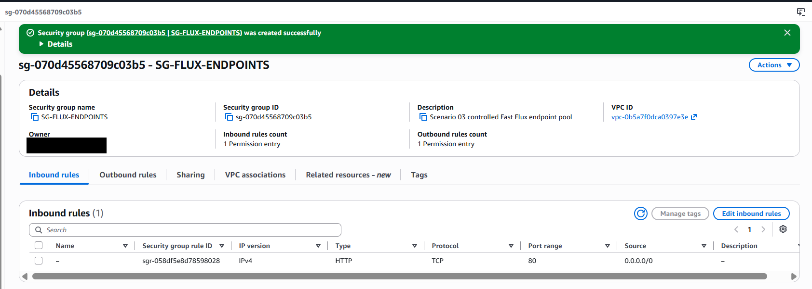
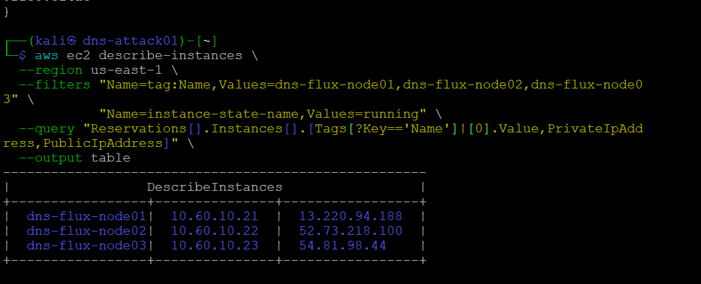
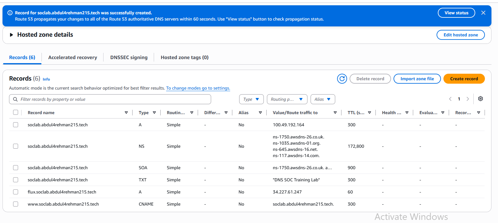
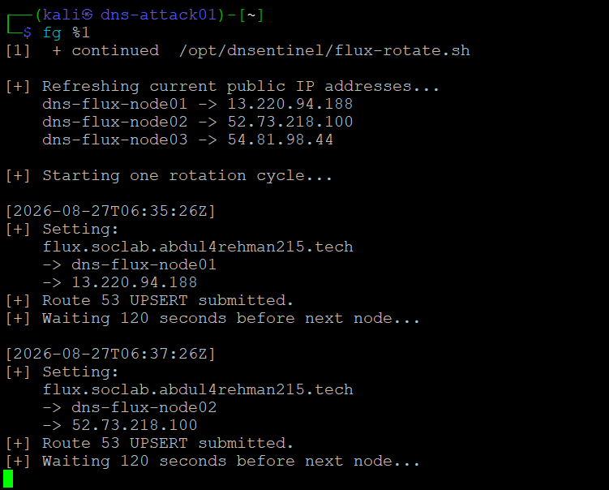
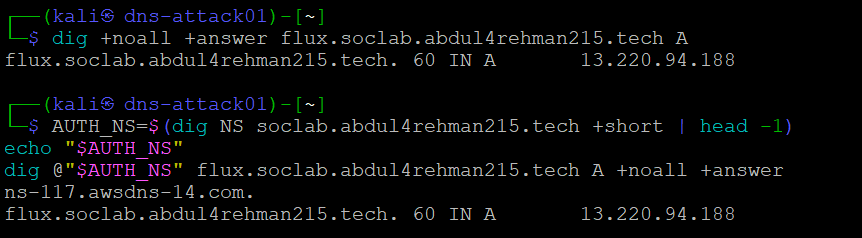
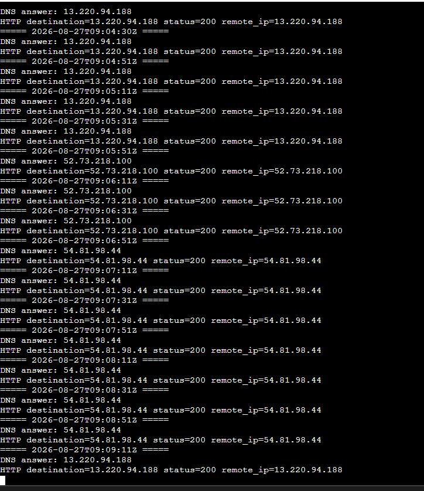

# Scenario 03 — Fast Flux Infrastructure Implementation

**Status:** ✅ Built, technically validated, exercised and closed out  
**Implementation owner:** [Musfira](https://github.com/MUSFIRA-ZAFAR)  
**Scenario:** `T1568.001 — Dynamic Resolution: Fast Flux DNS`

Scenario 03 extended the existing Scenario 02 defender platform rather than rebuilding the lab. The new infrastructure was limited to a controlled public destination pool, a short-TTL Route 53 record and a safe rotation mechanism.

## Reused platform

- `dns-soc-victim01` — `10.50.30.20`;
- `dns-soc-resolver01` — `10.50.30.10` / Unbound;
- Splunk Enterprise and shared AI bridge;
- Resolver Query Logs, VPC Flow Logs and AWS telemetry;
- existing Scenario 02 sinkhole/RPZ capability for later IR use.

No new VPC, Splunk server, second resolver or second sinkhole was created.

## New Scenario 03 resources

### Security group

`SG-FLUX-ENDPOINTS` in `ATTACK-LAB-VPC`:

```text
Inbound: TCP/80 from 0.0.0.0/0
No public SSH rule
```



### Controlled endpoint pool

| Host | Private IP | Purpose |
|---|---:|---|
| `dns-flux-node01` | `10.60.10.21` | controlled HTTP Fast Flux node |
| `dns-flux-node02` | `10.60.10.22` | controlled HTTP Fast Flux node |
| `dns-flux-node03` | `10.60.10.23` | controlled HTTP Fast Flux node |

The nodes served simple Nginx pages so the victim could genuinely connect to whatever address DNS returned.

> **Closeout state:** these three EC2s were temporary Scenario 03 resources and were stopped/deleted/reset after the official exercise. The table above is retained as the historical build/addressing record.

### Public address handling

The account did not dedicate three additional Elastic IPs to the temporary pool. Instead, the rotation mechanism refreshes the current public IPv4 address of each node before using it. Exercise-time observed values were:

```text
node01 -> 13.220.94.188
node02 -> 52.73.218.100
node03 -> 54.81.98.44
```



These are evidence values, not permanent architecture constants.

## Route 53 Fast Flux record

Controlled name:

```text
flux.soclab.abdul4rehman215.tech
```

Record type: `A`  
TTL: `60` seconds



## Rotation control

The live control path used `/opt/dnsentinel/flux-rotate.sh`. Its source was preserved from the infrastructure build conversation and is stored at [`configs/scenario-03/flux-rotate.sh`](configs/scenario-03/flux-rotate.sh). The script:

1. refreshes the current public addresses of the three nodes;
2. UPSERTs the `flux.soclab...` A record to one node;
3. waits 120 seconds;
4. advances to the next node;
5. repeats.



The scenario repository also preserves the same validated script under its engineering-evidence workspace for reproducibility.

## IAM boundary

The scenario-control host needed only enough AWS access to:

- discover the controlled node public IPs;
- change the intended Route 53 record set.

The implementation avoided broad public-DNS administration. The repository-safe policy is preserved at [`configs/scenario-03/iam/DNSentinel-Scenario03-Flux-Rotation.json`](configs/scenario-03/iam/DNSentinel-Scenario03-Flux-Rotation.json). No credentials or tokens are stored in this repository.

## Technical validation

### Authoritative DNS

The current Route 53 authoritative server was queried directly to avoid confusing resolver cache behavior with authoritative state.



### Resolver / TTL behavior

The victim was queried through the defender resolver. TTL values counted down and refreshed after expiry, proving the client-side path could observe changing authoritative answers.

### Victim follow-up

The validation loop resolved the current answer through `10.50.30.10`, then made an HTTP request to exactly that returned IP with the Fast Flux hostname in the Host header. The victim successfully followed all three controlled nodes.



### Network telemetry

VPC Flow Logs captured victim traffic to the rotating public destinations and Splunk ingested the evidence.


## Infrastructure validation gate

The build was considered ready for Detection Engineering only after all of these were true:

- three controlled destinations reachable;
- short-TTL Fast Flux A record exists;
- Route 53 UPSERT works;
- authoritative answers change;
- defender resolver sees refreshed answers;
- victim follows those answers successfully;
- VPC Flow records the destination changes;
- Splunk receives DNS/network evidence.

## Troubleshooting lesson — a paused rotation looked like DNS failure

At one point `Ctrl+Z` suspended the foreground rotation script. Route 53 therefore remained on the last submitted node even though DNS itself was healthy. Resuming the job restored future UPSERT changes.

The lesson was to validate the control process before changing DNS/resolver configuration.

## Cleanup / operational closeout

The official Scenario 03 exercise has now been completed in the dedicated scenario repository.

Closeout state:

1. the live rotation controller was stopped and its process absence was confirmed;
2. the victim follow-up loop was stopped;
3. Incident Response found no active Scenario 03 RPZ rule and therefore did not perform an unnecessary containment change;
4. `unbound-checkconf`, service state and victim-side normal DNS were verified;
5. the three temporary Fast Flux EC2 nodes were stopped/deleted/reset after the exercise;
6. final operator/SOC/IR evidence and ground-truth comparison are maintained in the Scenario 03 repository.

The exact temporary-node teardown timestamp was not part of the preserved evidence package, so this infrastructure record does not manufacture one. The node IPs and public addresses above remain as historical implementation/evidence values only.
