# Scenario 04 — DNS Tunneling Infrastructure

**Status:** ✅ Infrastructure complete / Scenario execution not started  
**Implemented by:** Lubaba  
**Build date:** 2026-08-29  
**Primary scenario technique:** `T1071.004 — Application Layer Protocol: DNS`  
**Next phase:** Detection Engineering

Scenario 04 did not require another lab redesign. It reuses the private defender-DNS platform built for Scenario 02 and adds one controlled public authoritative DNS endpoint because the final tunneling design needs a real destination that can **receive fresh synthetic labels**.

This document records the infrastructure that actually exists. It does not claim that the tunneling simulation, Splunk detection, SOC investigation or IR containment has already happened.

## 1. What changed for Scenario 04

Existing reusable components remained unchanged:

```text
dns-soc-victim01     10.50.30.20   controlled client
dns-soc-resolver01   10.50.30.10   Unbound defender resolver
dns-soc-sinkhole01   10.50.30.30   reusable private sinkhole
dns-soc-splunk01     10.50.20.10   Splunk Enterprise + shared AI bridge
```

Scenario 04 added:

| Resource | Implemented state |
|---|---|
| `dns-tunnel-auth01` | Ubuntu 24.04 / `t3.small` / 20 GiB gp3 |
| Private IPv4 | `10.60.10.30` |
| Network | Existing `ATTACK-LAB-VPC` / `ATTACK-PUBLIC-SUBNET` |
| Management | SSM; no public SSH |
| Security group | `SG-TUNNEL-AUTH` |
| Public service | BIND authoritative DNS on TCP/UDP 53 |
| Authoritative zone | `tunnel.soclab.abdul4rehman215.tech` |
| Query ground truth | `/var/log/named/scenario04-queries.log` |
| Route 53 change | Nested `tunnel` NS delegation + `ns1.tunnel` A record |

No new VPC, subnet, NAT Gateway, resolver, victim, sinkhole, Splunk server or AI service was created.

## 2. Final traffic path

```text
dns-soc-victim01
10.50.30.20
       |
       | normal operating-system DNS
       v
dns-soc-resolver01
10.50.30.10
Unbound
       |
       | upstream recursive resolution
       v
AWS VPC Resolver / public DNS
       |
       | Route 53 delegation
       v
tunnel.soclab.abdul4rehman215.tech
       |
       v
dns-tunnel-auth01
10.60.10.30
BIND authoritative-only
       |
       +--> wildcard authoritative answer
       +--> Scenario 04 query ground truth
```

The later response path remains the already-built Scenario 02 control:

```text
Victim -> Unbound RPZ -> 10.50.30.30 -> dns-soc-sinkhole01
```

At infrastructure-build time, that response path was **available infrastructure**, not yet an executed containment claim. The later official IR phase subsequently validated the same path temporarily and restored it safely; detailed evidence remains in the dedicated Scenario 04 repository.

## 3. Public authoritative security boundary

`SG-TUNNEL-AUTH` was created specifically for the authoritative endpoint.

Final public inbound exposure:

```text
UDP 53 <- 0.0.0.0/0
TCP 53 <- 0.0.0.0/0
```

No SSH rule was added. Public DNS access is intentional here because this host is the delegated authoritative server. This is different from `dns-soc-resolver01`, which remains a private recursive resolver and must not be exposed as an open resolver.

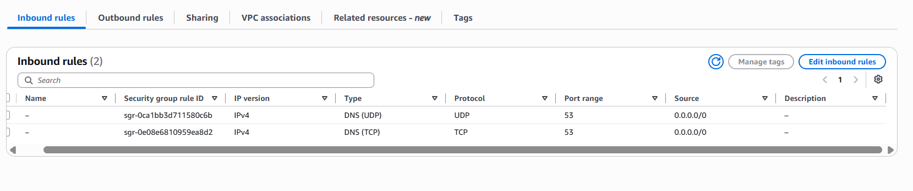

*The Scenario 04 security group exposes DNS only. Administrative access remains through SSM.*

## 4. BIND authoritative-only configuration

BIND 9.20.18 was installed on `dns-tunnel-auth01` with `bind9-utils` and `dnsutils`.

The final service is intentionally narrow:

```text
recursion no
allow-query any
listen IPv4
no IPv6 listener
no local DNSSEC validation
zone transfer disabled
```

The Ubuntu service was also started with `-4` so BIND does not attempt unnecessary IPv6 operations on this IPv4-only lab subnet.

Repository-safe configuration is preserved in [`configs/scenario-04/`](configs/scenario-04/).

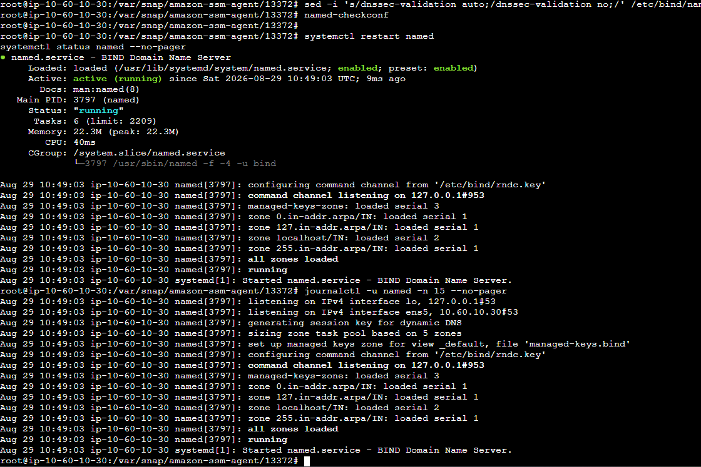

*After the cleanup, `named` is active and running with the IPv4-only service option rather than repeatedly attempting unreachable IPv6 DNS paths.*

### Why the service is not recursive

The host exists to answer only for the controlled child zone. It is **not** intended to resolve arbitrary Internet names for external clients. Keeping recursion disabled prevents the exercise endpoint from becoming an Internet-facing recursive DNS service.

## 5. Controlled tunnel child zone

The authoritative server hosts:

```text
tunnel.soclab.abdul4rehman215.tech
```

The build used a 60-second TTL and a wildcard A record so fresh labels under the controlled parent can receive an authoritative response without creating thousands of static Route 53 records.

The preserved zone file is [`configs/scenario-04/bind/db.tunnel.soclab`](configs/scenario-04/bind/db.tunnel.soclab).

`named-checkconf` and `named-checkzone` were run before restart.

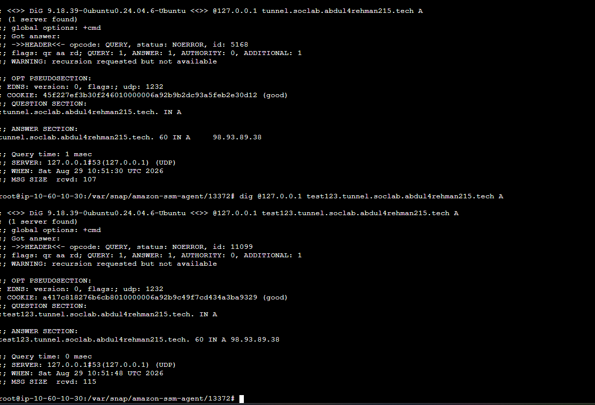

*The tunnel zone loads with serial `2026082901`, configuration validation passes and BIND restarts successfully.*

Both the zone apex and a fresh child label were queried directly against localhost.

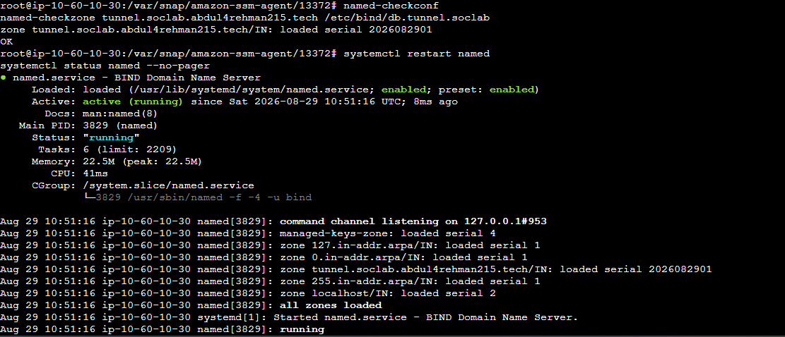

*The wildcard test receives an authoritative `NOERROR` A response, proving that fresh unique subdomains can be handled by the zone.*

## 6. Authoritative query ground truth

Scenario 04 needs an independent record of the names that actually reached the authoritative side. A dedicated BIND query channel was therefore configured:

```text
/var/log/named/scenario04-queries.log
```

A controlled `loggingtest` lookup was generated and then recovered from the log.

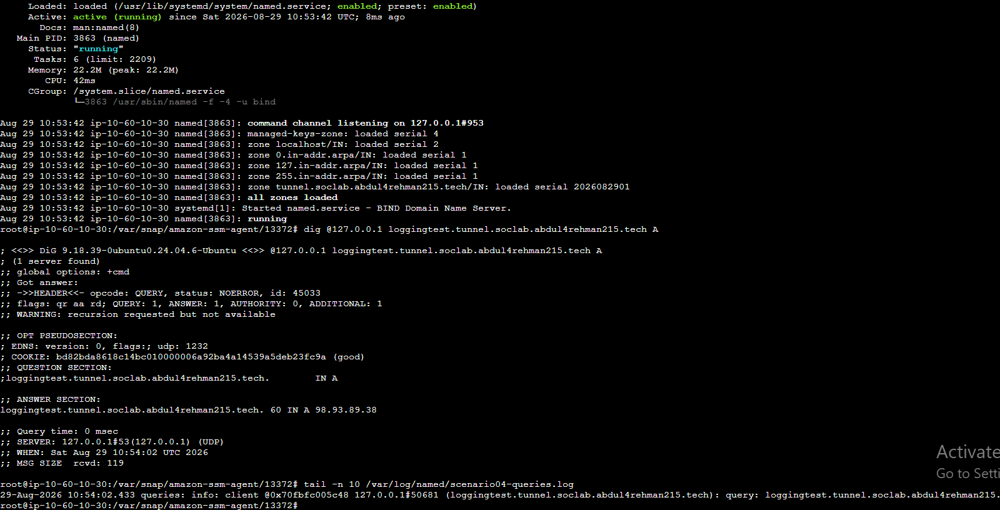

*The authoritative query log records the complete controlled qname. This file is operator/ground-truth evidence; it was not added as a new Splunk detection source during this phase.*

## 7. Route 53 nested delegation

The existing public child hosted zone `soclab.abdul4rehman215.tech` remains authoritative in Route 53. Scenario 04 adds a narrower delegation beneath it:

```text
soclab.abdul4rehman215.tech
       |
       +-- tunnel  NS  ns1.tunnel.soclab.abdul4rehman215.tech.
       |
       +-- ns1.tunnel  A  98.93.89.38
```

This sends only the `tunnel.soclab...` namespace to the controlled BIND server. The main SOC lab child zone remains in Route 53.

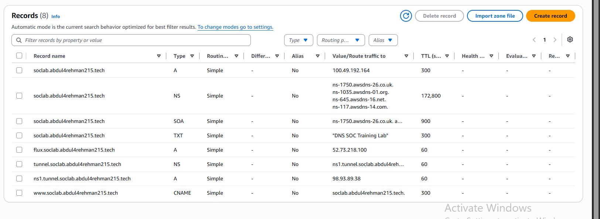

*The child hosted zone contains the nested `tunnel` NS delegation and its nameserver A record, both with a 60-second TTL.*

A normal recursive lookup then proved that public DNS followed the delegation and reached the controlled authoritative answer.

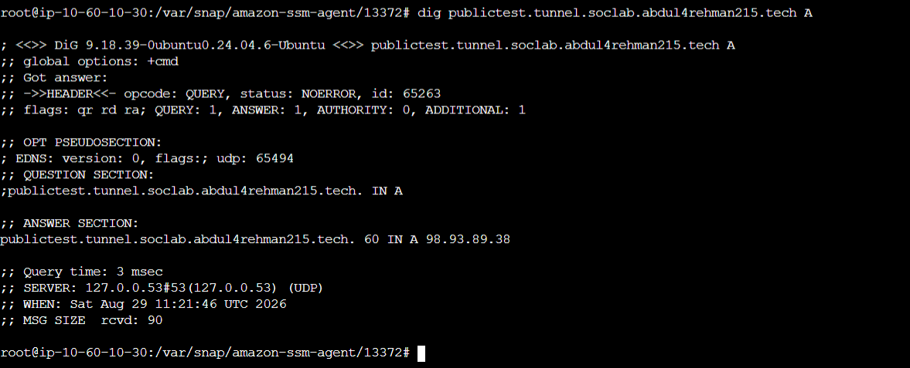

*`publictest.tunnel.soclab...` resolves through normal recursive DNS to the answer served by `dns-tunnel-auth01`.*

## 8. Defender-side victim path remained intact

The tunnel infrastructure is useful only if the victim still follows the defender-controlled resolver path rather than querying the authoritative server directly.

On `dns-soc-victim01`, `resolvectl status` showed:

```text
Current DNS Server: 10.50.30.10
DNS Servers:        10.50.30.10
```

A fresh `victimtest.tunnel.soclab...` lookup was then made using normal system DNS.

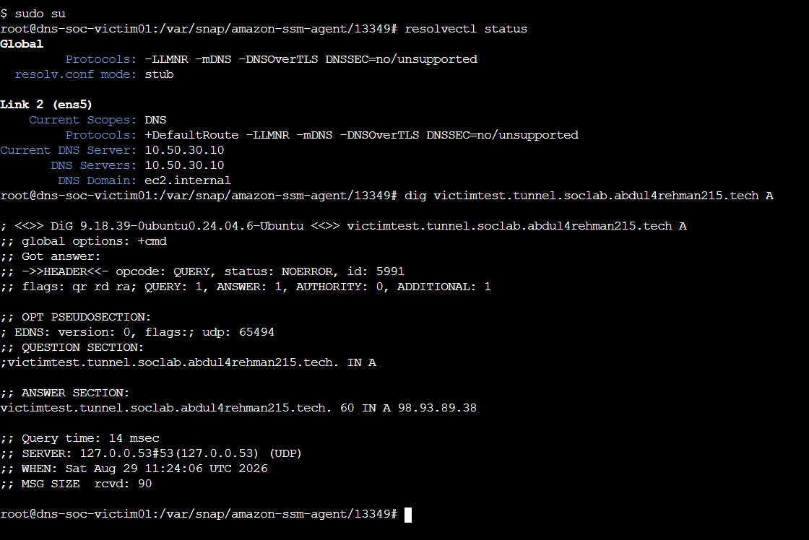

*The victim remains configured to use `dns-soc-resolver01` and successfully resolves a fresh Scenario 04 child name through that path.*

## 9. Two-sided evidence validation

The same fresh qname was checked at both DNS layers.

### Defender resolver view

Unbound uses the system journal in the deployed Scenario 02 configuration. It recorded the real client:

```text
10.50.30.20 -> victimtest.tunnel.soclab.abdul4rehman215.tech -> A -> NOERROR
```

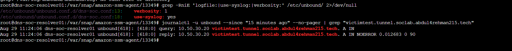

*The defender resolver preserves the actual client identity, which is the strongest source for attributing the query to `dns-soc-victim01`.*

### Authoritative view

The BIND log recorded the same qname reaching the public authoritative service.

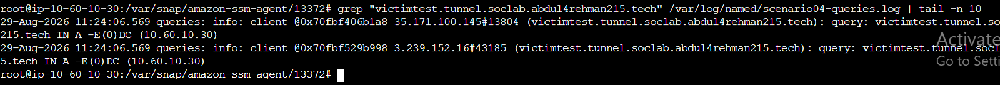

*The authoritative server sees public recursive-resolver source addresses rather than the original private victim. That is expected for this recursive-to-authoritative path and must not be misrepresented as direct client attribution.*

This difference is important for the later SOC investigation:

```text
Unbound = original lab client identity
BIND    = authoritative receipt / operator ground truth
```

## 10. Fresh-subdomain smoke test

Three new names were generated from the victim:

```text
s04smoke01.tunnel.soclab.abdul4rehman215.tech
s04smoke02.tunnel.soclab.abdul4rehman215.tech
s04smoke03.tunnel.soclab.abdul4rehman215.tech
```

All three reached the authoritative query log.

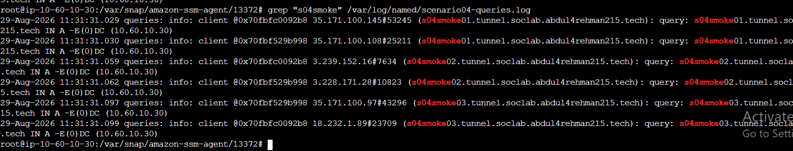

*The final smoke test proves the deployed path can carry multiple fresh unique child labels — a core prerequisite for later tunneling-pattern validation.*

## 11. Elastic IP quota limitation

The build originally attempted to assign a stable Elastic IP to `dns-tunnel-auth01`. AWS rejected the allocation because the regional Elastic-IP quota was already full.

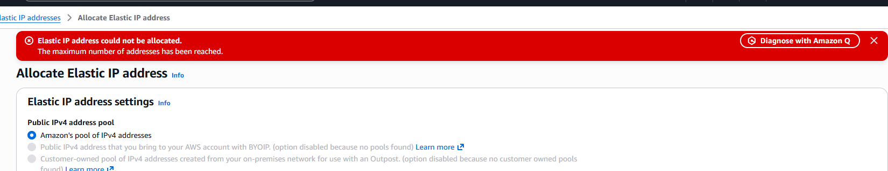

*The quota error changed the final operational state: the authoritative endpoint remained on an auto-assigned public IPv4 during this build.*

The public address used during validation was:

```text
98.93.89.38
```

It is **not an Elastic IP** and is not treated as a permanent architecture constant.

### Pre-execution check

Before the official Scenario 04 run:

1. confirm `dns-tunnel-auth01` still has the expected public IPv4;
2. if the address changed, update Route 53 `ns1.tunnel`;
3. update the BIND zone A records and SOA serial;
4. validate/restart BIND;
5. repeat the public and victim smoke tests.

Avoid stopping/starting this instance until that check is understood, because an auto-assigned public IPv4 can change.

## 12. What infrastructure completion means

Scenario 04 infrastructure is ready because the team has proven:

- the authoritative host exists and is reachable on DNS only;
- BIND is authoritative-only and recursion is disabled;
- the controlled child zone and wildcard work;
- Route 53 delegates the child namespace to the authoritative endpoint;
- the normal victim DNS path still uses the defender resolver;
- Unbound records the original client and DNS result;
- the authoritative server records the received qname;
- multiple fresh unique subdomains traverse the full path;
- the existing Scenario 02 RPZ/sinkhole remains available for a later human-approved response.

Infrastructure completion did **not** mean the security scenario was complete at build time. The later Detection Engineering and official execution phases have now been completed separately.

## 13. Later phases — now completed in the scenario repository

This infrastructure document intentionally did not implement the later security workflow. Those phases have now been completed in `Scenario-04-DNS-Tunneling`:

- finite encoded-label operator client / official session;
- Scenario 04 baseline and feature engineering;
- Detection v1.0;
- Dashboard Studio / scheduled alert;
- `dns_tunneling_v1` AI evidence mapping;
- information-separated SOC investigation;
- SOC→IR handoff;
- independent IR validation;
- human-approved temporary RPZ/sinkhole verification;
- safe reset and final ground-truth comparison.

The shared Infrastructure repository records only the platform state; detailed scenario evidence belongs in the dedicated Scenario 04 repository.

## 14. Repository artifacts

- [`configs/scenario-04/README.md`](configs/scenario-04/README.md) — final configuration map and public-IP constraint.
- [`configs/scenario-04/COMMAND-LEDGER.md`](configs/scenario-04/COMMAND-LEDGER.md) — cleaned command ledger.
- [`configs/scenario-04/ARTIFACT-MANIFEST.md`](configs/scenario-04/ARTIFACT-MANIFEST.md) — ownership and evidence boundary.
- [`screenshots/scenario-04-dns-tunneling/README.md`](screenshots/scenario-04-dns-tunneling/README.md) — curated evidence manifest.
- [`../01-network-architecture/diagrams/scenario-04-dns-tunneling.mmd`](../01-network-architecture/diagrams/scenario-04-dns-tunneling.mmd) — final infrastructure flow.


## 15. Official Scenario 04 closeout synchronization

The completed exercise later proved the infrastructure in operational use:

```text
10.50.30.20 / victim
  → 10.50.30.10 / Unbound
  → public DNS / delegation
  → dns-tunnel-auth01 / BIND
  → Splunk Detection v1.0 / AI / SOC
  → IR-approved temporary RPZ
  → 10.50.30.30
  → safe reset
```

The official seven-query burst reached both Unbound and the authoritative BIND endpoint. Detection v1.0 fired without live tuning, SOC escalated with explicit attribution limits, and IR later proved the existing RPZ/sinkhole design before restoring the pre-change state.
