[🏠 Repository Home](../README.md) · [🔎 Splunk Build](../03-splunk-build/README.md) · **🤖 AI Integration**

**Status:** ✅ Complete  
**Implementation owner:** [_Musfira_](https://github.com/MUSFIRA-ZAFAR) — **Shared AI Integration**

The shared AI foundation is deployed and validated. It is common infrastructure for all four DNS SOC scenarios: Splunk sends an alert result to a controlled bridge, the bridge obtains schema-constrained analyst context from the OpenAI API, and the result is written back to Splunk for **human review**.


## 🧠 Shared AI Flow

```mermaid
flowchart TB

    %% =====================================================
    %% ROW 1 — ALERT + AI PROCESSING
    %% =====================================================
    subgraph AI_PIPE[" "]
        direction LR

        H1["🧠 1 · Alert & AI Processing"]

        A["🚨 Splunk<br/>Scheduled Alert"]
        B["🔗 Internal<br/>Webhook"]
        C["⚙️ AI Bridge<br/>Flask + Gunicorn"]
        D["🧠 OpenAI<br/>Responses API"]

        H1 --> A --> B --> C --> D
    end


    %% =====================================================
    %% ROW 2 — RETURN + HUMAN VALIDATION
    %% =====================================================
    subgraph RETURN_PIPE[" "]
        direction LR

        H2["🔎 2 · Return & Human Validation"]

        E["📦 Structured<br/>JSON Result"]
        F["📥 Splunk HEC<br/>HTTPS :8088"]
        G["🗃️ dns_soc_ai<br/>dns_soc:ai:triage"]
        H["👤 SOC Analyst<br/>Validates Raw Evidence"]

        H2 --> E --> F --> G --> H
    end


    %% =====================================================
    %% GROUP-TO-GROUP CONNECTION
    %% Keeps both rows horizontal
    %% =====================================================
    AI_PIPE --> RETURN_PIPE


    %% =====================================================
    %% HEADER STYLES
    %% =====================================================
    classDef aiHeader fill:#3b0764,stroke:#c084fc,stroke-width:2px,color:#ffffff;
    classDef humanHeader fill:#083344,stroke:#22d3ee,stroke-width:2px,color:#ffffff;

    class H1 aiHeader;
    class H2 humanHeader;


    %% =====================================================
    %% NODE STYLES
    %% =====================================================
    classDef alert fill:#450a0a,stroke:#f87171,stroke-width:2px,color:#ffffff;
    classDef webhook fill:#172554,stroke:#60a5fa,stroke-width:2px,color:#ffffff;
    classDef bridge fill:#312e81,stroke:#818cf8,stroke-width:2px,color:#ffffff;
    classDef api fill:#581c87,stroke:#e879f9,stroke-width:2px,color:#ffffff;

    classDef json fill:#422006,stroke:#fbbf24,stroke-width:2px,color:#ffffff;
    classDef hec fill:#083344,stroke:#22d3ee,stroke-width:2px,color:#ffffff;
    classDef index fill:#052e16,stroke:#4ade80,stroke-width:2px,color:#ffffff;
    classDef analyst fill:#14532d,stroke:#4ade80,stroke-width:3px,color:#ffffff;

    class A alert;
    class B webhook;
    class C bridge;
    class D api;

    class E json;
    class F hec;
    class G index;
    class H analyst;


    %% =====================================================
    %% CONTAINER STYLES
    %% =====================================================
    style AI_PIPE fill:#0d1117,stroke:#c084fc,stroke-width:1px
    style RETURN_PIPE fill:#0d1117,stroke:#22d3ee,stroke-width:1px

    linkStyle default stroke:#94a3b8,stroke-width:2px
```



> [!IMPORTANT]
> AI provides **analyst assistance**, not the final security decision. `human_validation_required=true` remains part of the design boundary.

## ⚙️ Final Implementation State

| Item | Implemented state |
|---|---|
| Host | Existing `dns-soc-splunk01`; no new EC2 |
| Bridge container | `dns-soc-ai-bridge` |
| Application | Flask served by Gunicorn |
| Docker network | `dns-soc-internal` |
| Bridge port | TCP `5000`, Docker-internal only |
| Splunk HEC | TCP `8088`, Docker-internal only |
| OpenAI API | Responses API |
| Model used during foundation validation | `gpt-5.6-terra`, configured through `OPENAI_MODEL` |
| Splunk destination | `index=dns_soc_ai` |
| Splunk sourcetype | `dns_soc:ai:triage` |
| Webhook endpoint | `http://dns-soc-ai-bridge:5000/splunk-webhook` |
| Health endpoint | `/health` |
| AI decision boundary | Advisory only; `human_validation_required=true` |

No AWS security-group rule was added for TCP `5000` or `8088`. Only the existing Splunk Web and Universal Forwarder receiver remain host-published from the Compose stack.

## 📦 Structured Analyst Output

```text
summary
observed_indicators
network_context
  primary_osi_layer
  related_layers
  protocols
  explanation
suspicion_reasons
mitre_attack
  tactic
  technique_id
  technique_name
  explanation
cyber_kill_chain
  stage
  explanation
missing_evidence
response_considerations
confidence
human_validation_required
```

The model is instructed to prefer uncertainty over unsupported assumptions. MITRE ATT&CK and Cyber Kill Chain fields remain analyst context, not final classifications.

## ✅ Validation Completed

- Direct OpenAI API authentication succeeded from `dns-soc-splunk01`.
- Both Docker containers were healthy on `dns-soc-internal`.
- A dedicated HEC token wrote only to `dns_soc_ai` using `dns_soc:ai:triage`.
- The bridge accepted Splunk's native webhook envelope and normalized the first result row into the common alert contract.
- A strong synthetic alert produced structured analyst context in Splunk.
- An incomplete synthetic alert returned low confidence, `Uncertain` framework context and a meaningful missing-evidence list.
- Human review confirmed the strong and incomplete outputs behaved differently as intended.
- An invalid payload returned HTTP `400` / `schema_validation_failed` and created no bad AI event.
- Final strong-vs-incomplete comparison passed with `human_validation_required=true` for both results.

The strong synthetic result also demonstrated why framework mappings remain advisory: the model suggested `T1595 — Active Scanning`, while the analyst must evaluate the scenario's intended `T1590.002` DNS reconnaissance mapping against the real evidence.

## 📚 AI Documents

| Document | Focus |
|---|---|
| 🏗️ [`01-architecture-and-security.md`](01-architecture-and-security.md) | Final network/security boundary and trust model |
| 🐍 [`02-bridge-deployment.md`](02-bridge-deployment.md) | Flask/OpenAI/Docker implementation |
| 🔁 [`03-splunk-hec-and-webhook.md`](03-splunk-hec-and-webhook.md) | HEC, webhook allow-list and native Splunk payload handling |
| ✅ [`04-validation-and-operations.md`](04-validation-and-operations.md) | Strong/incomplete/failure tests, human validation and operating checks |
| 📦 [`bridge/`](bridge/) | Repository-safe bridge source, Dockerfile and dependencies |
| ⚙️ [`configs/`](configs/) | Safe environment and Splunk allow-list examples |
| 🧾 [`schemas/`](schemas/) | Request/response schemas enforced by `app.py` |
| 🧪 [`validation/`](validation/) | Reusable synthetic SPL and final validation searches |
| 🖼️ [`screenshots/`](screenshots/) | Selected implementation evidence |

## 🔄 Scenario Handoff

The bridge stays scenario-neutral. A scenario repository adds only its stable evidence mapping/profile after detection fields are ready:

Scenario 02 validates this reuse pattern with `scenario_id=scenario-02-dga` / `dga_nxdomain_v1`. Scenario 04 now also validates the same shared foundation with `scenario_id=scenario-04-dns-tunneling` / `dns_tunneling_v1`; its frozen detection evidence and AI mapping remain in the dedicated Scenario 04 repository.

```text
scenario detection
      ↓
analyst-ready evidence fields
      ↓
scenario profile / payload mapping
      ↓
shared AI bridge
      ↓
dns_soc_ai
      ↓
human validation
```


[🔎 Previous: Splunk Build](../03-splunk-build/README.md) · [🏠 Repository Home](../README.md)
