<div align="center">


<br/>


**Shared infrastructure and engineering record for a four-person, DNS-focused SOC lab built around AWS, Splunk Enterprise, information-separated adversary exercises against project-owned public services, detection engineering, threat hunting, incident response and AI-assisted analyst context.**

[Project at a Glance](#-project-at-a-glance) · [Architecture](#-architecture-at-a-glance) · [Telemetry](#-security-telemetry-pipeline) · [Status](#-project-status) · [Team](#-team--rotating-roles) · [Repository](#-repository-navigation)

</div>


## 🎯 Project at a Glance

One SOC platform supports **four DNS security scenarios**. The infrastructure stays common where possible; scenario-specific resources are added only when a scenario needs them.

| Scenario | Security focus | MITRE ATT&CK | What the team practices |
|---|---|---|---|
| 🔎 [**01 — DNS Reconnaissance & Enumeration**](https://github.com/DNSentinel-Lab/Scenario-01-DNS-Recon) | Abnormal DNS record enumeration and follow-up activity | `T1590.002` | Public DNS visibility, detection, investigation and evidence correlation |
| 🧬 [**02 — DGA + High NXDOMAIN**](https://github.com/DNSentinel-Lab/Scenario-02-DGA) | Generated-domain behavior and abnormal NXDOMAIN activity | `T1568.002` | Defender-controlled resolution, baselining, detection/ML and containment path |
| 🔄 [**03 — Fast Flux DNS**](https://github.com/DNSentinel-Lab/Scenario-03-Fast-Flux) | Rapidly changing DNS answers and short-TTL behavior | `T1568.001` | DNS answer/TTL correlation and destination-change analysis |
| 🛰️ [**04 — DNS Tunneling**](https://github.com/DNSentinel-Lab/Scenario-04-DNS-Tunneling) | Controlled encoded DNS behavior | `T1071.004` / `T1572` where the implemented behavior fits | Suspicious query-pattern detection, investigation and response verification |

> MITRE mappings describe the behavior the team intends to simulate.

<div align="center">


</div>


## 🏗️ Architecture at a Glance

```mermaid
flowchart TB

    %% =====================================================
    %% SCENARIOS
    %% =====================================================
    subgraph SC[" "]
        direction TB
        SCH["🧭 Four DNS Security Scenarios"]

        subgraph SCGRID[" "]
            direction LR

            subgraph SCL[" "]
                direction TB
                S1["🔎 01 · DNS Recon"]
                S2["🧬 02 · DGA + NXDOMAIN"]
            end

            subgraph SCR[" "]
                direction TB
                S3["🔄 03 · Fast Flux"]
                S4["🛰️ 04 · DNS Tunneling"]
            end
        end
    end


    %% =====================================================
    %% ENTRY PATHS
    %% =====================================================
    subgraph ENTRY[" "]
        direction LR
        PUB["🌐 Public DNS<br/>/ Web"]
        DEF["🛡️ Defender<br/>DNS Path"]
    end


    %% =====================================================
    %% CORE
    %% =====================================================
    subgraph CORE[" "]
        direction TB
        CH["📡 Telemetry + Analysis"]

        TEL["DNS · Web · Network<br/>AWS · Host"]

        SPL["🟢 Splunk<br/>Enterprise"]

        subgraph ANAL[" "]
            direction LR
            AI["🤖 AI<br/>Summary"]
            SOC["🔎 SOC Analysis<br/>+ Hunting"]
        end

        IR["🛡️ IR / Defense"]
    end


    %% =====================================================
    %% FLOW
    %% =====================================================
    S1 --> PUB
    S2 --> DEF
    S3 --> DEF
    S4 --> DEF

    PUB --> TEL
    DEF --> TEL

    CH --> TEL
    TEL --> SPL
    SPL --> AI
    SPL --> SOC
    AI --> SOC
    SOC --> IR
    IR -. "Block / Sinkhole / Verify" .-> DEF


    %% =====================================================
    %% HEADER STYLES
    %% =====================================================
    classDef scenHeader fill:#2a1f0f,stroke:#fbbf24,stroke-width:2px,color:#ffffff;
    classDef coreHeader fill:#0f2238,stroke:#60a5fa,stroke-width:2px,color:#ffffff;

    class SCH scenHeader;
    class CH coreHeader;


    %% =====================================================
    %% NODE STYLES
    %% =====================================================
    classDef scenario fill:#1f2937,stroke:#f59e0b,stroke-width:2px,color:#ffffff;
    classDef public fill:#172554,stroke:#60a5fa,stroke-width:2px,color:#ffffff;
    classDef defender fill:#083344,stroke:#22d3ee,stroke-width:2px,color:#ffffff;

    classDef telemetry fill:#312e81,stroke:#818cf8,stroke-width:2px,color:#ffffff;
    classDef splunk fill:#052e16,stroke:#4ade80,stroke-width:3px,color:#ffffff;
    classDef ai fill:#581c87,stroke:#e879f9,stroke-width:2px,color:#ffffff;
    classDef soc fill:#164e63,stroke:#38bdf8,stroke-width:2px,color:#ffffff;
    classDef ir fill:#450a0a,stroke:#f87171,stroke-width:3px,color:#ffffff;

    class S1,S2,S3,S4 scenario;
    class PUB public;
    class DEF defender;
    class TEL telemetry;
    class SPL splunk;
    class AI ai;
    class SOC soc;
    class IR ir;


    %% =====================================================
    %% CONTAINER STYLES
    %% =====================================================
    style SC fill:#0d1117,stroke:#fbbf24,stroke-width:1px
    style SCGRID fill:#111827,stroke:#30363d,stroke-width:1px
    style SCL fill:#111827,stroke:#30363d,stroke-width:1px
    style SCR fill:#111827,stroke:#30363d,stroke-width:1px

    style ENTRY fill:#0d1117,stroke:#60a5fa,stroke-width:1px

    style CORE fill:#0d1117,stroke:#4ade80,stroke-width:1px
    style ANAL fill:#111827,stroke:#30363d,stroke-width:1px

    %% =====================================================
    %% EDGE STYLES
    %% =====================================================
    linkStyle default stroke:#94a3b8,stroke-width:2px
```



The detailed network, DNS authority, trust boundaries, CIDRs, security groups and traffic paths live in [`01-network-architecture/`](01-network-architecture/). The registrar/delegation chain is documented specifically in [`01-network-architecture/dns-authority-and-delegation.md`](01-network-architecture/dns-authority-and-delegation.md).


## 📡 Security Telemetry Pipeline

Splunk is the central evidence and analysis layer. The project combines public DNS, network, cloud, web and defender-controlled DNS telemetry instead of treating one source as the whole investigation.

```mermaid
flowchart LR

    %% =====================================================
    %% SOURCES
    %% =====================================================
    subgraph SOURCES[" "]
        direction TB
        SH["📡 Telemetry Sources"]

        WEB["🌐 Web / Nginx"]
        DNS["🛡️ Unbound<br/>+ Sinkhole"]
        R53["🌍 Route 53<br/>Public DNS"]
        VPC["🔀 VPC Flow"]
        CT["🧾 CloudTrail"]
        RQ["🔎 Resolver Logs"]
    end


    %% =====================================================
    %% SPLUNK CORE
    %% =====================================================
    SPL["🟢 Splunk Enterprise<br/>Evidence + Analysis"]


    %% =====================================================
    %% RIGHT SIDE
    %% =====================================================
    subgraph RIGHT[" "]
        direction TB

        DATA["🗃️ Core Indexes<br/>aws · web · dns"]

        subgraph AI[" "]
            direction TB
            AH["🤖 Shared AI Enrichment"]

            AIB["⚙️ Shared<br/>AI Bridge"]
            OAI["🧠 OpenAI API"]
            AIDX["📝 AI Triage<br/>dns_soc_ai"]

            AH --> AIB
            AIB --> OAI
            OAI --> AIB
            AIB --> AIDX
        end
    end


    %% =====================================================
    %% INGESTION
    %% =====================================================
    WEB -->|"UF 9997"| SPL
    DNS -->|"UF 9997"| SPL
    R53 -->|"CW / Kinesis"| SPL
    VPC -->|"S3 / SQS"| SPL
    CT -->|"S3 / SQS"| SPL
    RQ -->|"S3 / SQS"| SPL


    %% =====================================================
    %% OUTPUTS
    %% =====================================================
    SPL --> DATA
    SPL -->|"Webhook"| AIB

    %% =====================================================
    %% HEADER STYLES
    %% =====================================================
    classDef sourceHeader fill:#0f2238,stroke:#60a5fa,stroke-width:2px,color:#ffffff;
    classDef aiHeader fill:#24123a,stroke:#c084fc,stroke-width:2px,color:#ffffff;

    class SH sourceHeader;
    class AH aiHeader;


    %% =====================================================
    %% NODE STYLES
    %% =====================================================
    classDef endpoint fill:#083344,stroke:#22d3ee,stroke-width:2px,color:#ffffff;
    classDef aws fill:#172554,stroke:#60a5fa,stroke-width:2px,color:#ffffff;
    classDef splunk fill:#052e16,stroke:#4ade80,stroke-width:3px,color:#ffffff;
    classDef data fill:#1f2937,stroke:#94a3b8,stroke-width:2px,color:#ffffff;
    classDef ai fill:#3b0764,stroke:#c084fc,stroke-width:2px,color:#ffffff;
    classDef api fill:#581c87,stroke:#e879f9,stroke-width:2px,color:#ffffff;
    classDef aidx fill:#422006,stroke:#fbbf24,stroke-width:2px,color:#ffffff;

    class WEB,DNS endpoint;
    class R53,VPC,CT,RQ aws;
    class SPL splunk;
    class DATA data;
    class AIB ai;
    class OAI api;
    class AIDX aidx;


    %% =====================================================
    %% CONTAINER STYLES
    %% =====================================================
    style SOURCES fill:#0d1117,stroke:#58a6ff,stroke-width:1px
    style RIGHT fill:#0d1117,stroke:#30363d,stroke-width:1px
    style AI fill:#0d1117,stroke:#c084fc,stroke-width:1px

    linkStyle default stroke:#94a3b8,stroke-width:2px
```



The AWS collection layer uses the supported Splunk Add-on for AWS `8.2.1`. Live implementation recorded the following source identities:

| Telemetry | Destination index | Actual sourcetype |
|---|---|---|
| Route 53 public authoritative query logs | `dns_soc_aws` | `aws:kinesis` |
| VPC Flow Logs | `dns_soc_aws` | `aws:cloudwatchlogs:vpcflow` |
| CloudTrail | `dns_soc_aws` | `aws:cloudtrail` |
| Route 53 Resolver Query Logs | `dns_soc_aws` | `aws:s3` |
| Nginx access telemetry | `dns_soc_web` | `dns_soc:nginx:access` |
| Team-controlled Unbound resolver | `dns_soc_dns` | `unbound:dns` |
| Private sinkhole Nginx access | `dns_soc_web` | `nginx:access` |

> The defender repository also preserves Flow/Resolver evidence from the original in-account `ATTACK-LAB-VPC`. The **official Scenario 01 separate-account attacker does not export attacker-side telemetry into Splunk**; defender analysis relies on Route 53 authoritative logs and target-side Web/network evidence.

> Detailed onboarding, source validation and field-quality evidence are maintained in [`03-splunk-build/`](03-splunk-build/).


## 🕶️ Official Scenario 01 adversary boundary

The official Scenario 01 exercise no longer uses the original in-account attack host as the defender-visible source. The Project Lead operates a Kali host from a **separate AWS account**, with an optional external Windows source, and reaches the lab only through public Internet services.

```text
External attacker account / Windows
        |
        | public DNS / HTTPS only
        v
Route 53 + public Web target
        |
        v
Defender telemetry → Splunk → SOC / IR
```

The SOC Analyst has no attacker-account inventory, no private network route and no live ground-truth feed. Historical `ATTACK-LAB-VPC` build evidence is retained as engineering history, but it is **not part of the official defender trust boundary for the completed exercise**. See [`01-network-architecture/external-adversary-boundary.md`](01-network-architecture/external-adversary-boundary.md).


## 🚦 Project Status

| Area | Current state |
|---|---|
| 🧭 Project design baseline | ✅ Complete / maintained |
| ☁️ Shared AWS network, identity, routing and access | ✅ Complete |
| 🌐 Route 53 authority, public DNS, Nginx and HTTPS | ✅ Complete |
| 🔎 Splunk Enterprise platform + six project indexes | ✅ Complete |
| 📡 Web + AWS security telemetry | ✅ Complete |
| 🤖 Shared AI foundation | ✅ Complete |
| 🛡️ Common shared infrastructure | ✅ Complete |
| 🔎 Scenario 01 detection engineering | ✅ Complete — maintained in separate Scenario 01 repository |
| 🧑‍💻 Scenario 01 external-adversary SOC / IR exercise | ✅ Complete — final evidence maintained in the Scenario 01 repository |
| 🧬 Scenario 02 defender DNS infrastructure + Splunk onboarding | ✅ Complete |
| 🧠 Scenario 02 Machine Learning Engineering | ✅ Complete — detailed in Scenario 02 repository |
| 🚦 Scenario 02 Detection Engineering / dashboard / alert / AI | ✅ Complete — maintained in separate Scenario 02 repository |
| 🧬 Scenario 02 official DGA / SOC / IR / RPZ exercise | ✅ Complete — final case evidence maintained in the Scenario 02 repository |
| 🔄 Scenario 03 Fast Flux infrastructure | ✅ Complete — three controlled nodes + short-TTL Route 53 rotation + victim/network validation |
| 🛰️ Scenario 04 tunneling-specific resources | ⚪ Conditional / planned when Scenario 04 begins |

Scenario-specific detections and exercises are maintained in the separate [scenario repositories](https://github.com/orgs/DNSentinel-Lab/repositories).

For chronological implementation detail, see [`00-project-design/project-roadmap.md`](00-project-design/project-roadmap.md) and [`00-project-design/scenario-infrastructure-roadmap.md`](00-project-design/scenario-infrastructure-roadmap.md).


## 👥 Team & Rotating Roles

The four-role assignment model rotates responsibilities across scenarios so team members practise multiple SOC viewpoints. The current canonical assignment is shown below. This model was **designed and proposed by [Lubaba](https://github.com/lubaba1513-pixel)**.

| Scenario | Project Lead / Adversary Operator | SOC Analyst / Hunter | Detection Engineer | IR / Defender |
|---|---|---|---|---|
| 01 — DNS Recon | [Abdul-Rehman](https://github.com/abdul4rehman215) | [Musfira](https://github.com/MUSFIRA-ZAFAR) | [Sonia](https://github.com/sonia11mansha415) | [Lubaba](https://github.com/lubaba1513-pixel) |
| 02 — DGA + NXDOMAIN | Musfira | Sonia | Lubaba | Abdul-Rehman |
| 03 — Fast Flux | Lubaba | Abdul-Rehman | Musfira | Sonia |
| 04 — DNS Tunneling | Lubaba | Abdul-Rehman | Musfira | Sonia |

```text
External Adversary → Telemetry → Detection → AI Assistance → Independent SOC Investigation → IR / Defense → Evidence-Backed Response → Documentation
```

See [`00-project-design/team-roles.md`](00-project-design/team-roles.md) for each role responsibilities.


## 🗂️ Repository Navigation

| Area | What you will find |
|---|---|
| 🧭 [`00-project-design/`](00-project-design/) | Scope, four-scenario model, roles, roadmaps and documentation standard |
| 🌐 [`01-network-architecture/`](01-network-architecture/) | VPC blueprint, CIDRs, DNS authority, trust boundaries, security groups and traffic flows |
| ☁️ [`02-aws-build/`](02-aws-build/) | Implemented AWS configuration, telemetry and Scenario 02 defender-DNS platform |
| 🔎 [`03-splunk-build/`](03-splunk-build/) | Splunk platform, indexes, Web/AWS/DNS onboarding, validation and operations |
| 🤖 [`04-ai-integration/`](04-ai-integration/) | Shared AI bridge, schemas, HEC/webhook path, validation and operating evidence |
| 🤝 [`CONTRIBUTING.md`](CONTRIBUTING.md) | Contribution workflow and repository expectations |


## 🧠 Engineering Areas Demonstrated

| Area | Practical work represented in this repository |
|---|---|
| **AWS Networking** | Multi-VPC design, subnets, routing, security groups, SSM-oriented administration and controlled trust boundaries |
| **DNS Engineering** | Route 53 authority/delegation, public DNS, defender-controlled resolution, Unbound, RPZ and sinkhole path |
| **Splunk Engineering** | Docker deployment, indexes, retention, Universal Forwarder, AWS add-on, HEC, source validation and data-quality checks |
| **Security Telemetry** | DNS, Nginx, VPC Flow, CloudTrail, Route 53 public queries and Resolver Query Logs |
| **Detection Engineering** | Scenario-specific detection hypotheses, SPL validation, tuning boundaries and MITRE discipline |
| **SOC Operations** | Analyst triage, threat hunting, evidence correlation, human validation and documentation |
| **Incident Response** | Containment design, DNS deny/sinkhole path, verification and response evidence |
| **AI Integration** | Shared Flask/LLM bridge that provides structured analyst assistance without replacing human judgement |
| **ML Integration** | Scenario 02 private `dns-soc-ml` service reads resolver evidence through Splunk REST and returns Isolation Forest results through HEC |


## 📚 Documentation Model

This repository deliberately separates **design**, **implementation** and **scenario evidence**:

- **Design documents** explain how the lab is intended to work and why decisions were made.
- **Build documents** record what was actually configured and how it was validated.
- **Troubleshooting documents** keep useful root causes and final fixes.
- **Scenario repositories** contain scenario-specific preparation, execution, detection, analysis, response and evidence.

The common 20-part scenario workflow, networking view, MITRE discipline and dashboard engineering standard are defined in [`00-project-design/scenario-documentation-standard.md`](00-project-design/scenario-documentation-standard.md).

> [!IMPORTANT]
> This lab is for **controlled security training** on infrastructure and domains owned by, or explicitly authorized for, the team.

<div align="center">

### DNSentinel Lab
**Build the telemetry. Prove the detection. Investigate the evidence. Verify the response.**

[⬆ Back to top](README.md)

</div>


